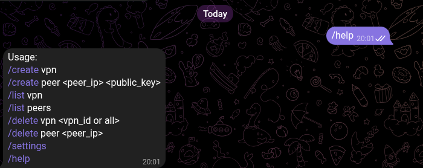
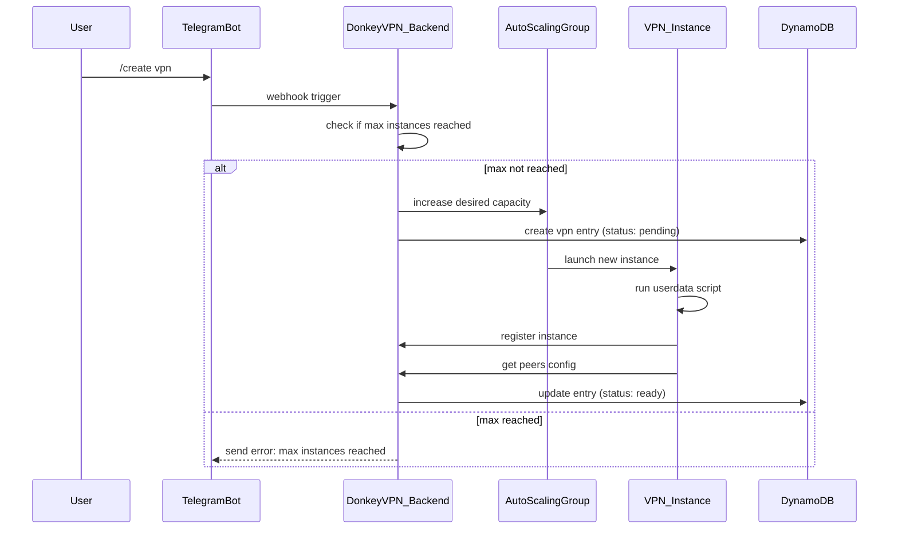
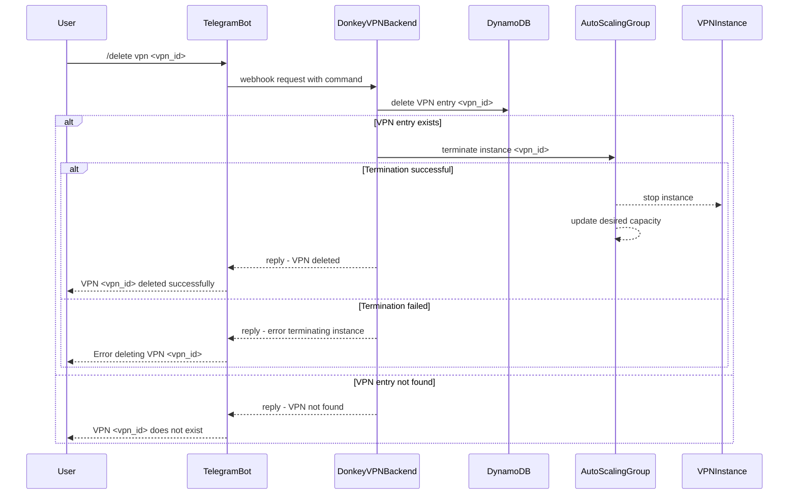
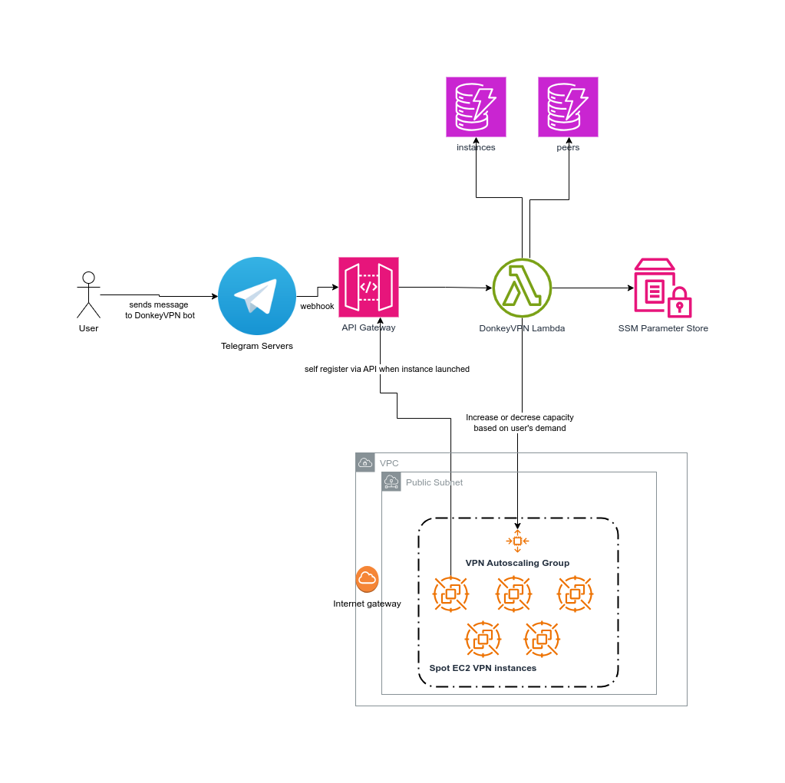

Donkey VPN - Low-Cost Ephemeral Wireguard VPN Servers
===

DonkeyVPN is a servereless Telegram-Powered Bot that manages the creation of ephemeral, low-cost Wireguard VPN servers.

## DonkeyVPN Demo
Here is a [Youtube demo I recorded](https://youtu.be/IPp3d39Z-Zc) on how to use DonkeyVPN after it was installed:

## Manuals
- [Installation](docs/installation.md)
- [Running on Android](docs/android.md)
- [Running on iOS](docs/ios.md)
- [Running on Linux](docs/linux.md)
- [Running on Windows (TODO)](docs/windows.md)
- [Running on MacOS (TODO)](docs/macos.md)
- [Local Development](docs/local-development.md)

## Roadmap
- [ ] Make the changes acordingly to support testing, this is very important
- [ ] Create missing documentation for Windows and MacOS
- [ ] Add an AWS cron job event to notify if there are instances that have been running for more than an hour.

## Design
There are two main entities:
- A VPN instance which has a logical representation in a DynamoDB table and a physical representation in an EC2 instance as part of an Autoscaling Group.
- A Peer which is a Wireguard peer that will be added to the VPN instance when launched.

DonkeyVPN has its business logic managed by a Golang Lambda function which processes all the commands sent to the Telegram Bot.f

If there is a VPN-related command such as `/create vpn <vpn_id>` or `/list vpn` it will interact mainly with the Autoscaling group and a DynamoDB table. If there is a peer related command such as `/create peer <ip> <pub-key>` or `/list peers` it will interact mainly with a DynamobDB table.

The two main workflows:

### VPN creation:

### VPN Deletion

### AWS architecture

