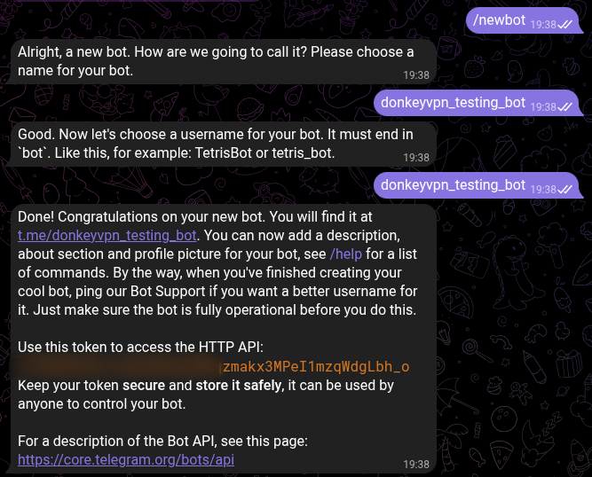
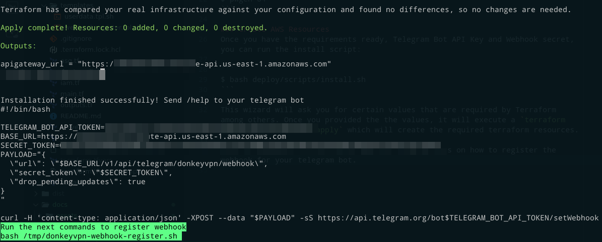

Installation
===

## Requirements
Before running the installation script, make sure you have the following requirements ready:
- Go 1.22+ properly installed.
- Terraform 1.9+ installed.
- Your AWS credentials and profile configured.

## Installation
### Create a Telegram Bot
Follow [Telegram's documentation](https://core.telegram.org/bots/tutorial) on how to create a bot by chatting with [@BotFather](https://t.me/botfather). Once you created your bot, you can obtain the token.



### Generating a Webhook secret
The way TelegramBot sends messages to the DonkeyVPN application is via webhooks (we will see how to configure that part later). But before creating AWS resources, you will need to generate a secure string that will be used as the webhook secret that Telegram will send to DonkeyVPN.

You can use your preferred random string generator, in my case I will use `pwgen`

```
$ pwgen 84
```

### Create AWS Resources
Once you have the requirements ready, Telegram Bot API Key and Webhook secret, you can run the install script:

```
$ bash deploy/scripts/install.sh
```

This wizard will ask you for certain values that are required by Terraform among others. Once you provided the the values, it will execute a `terraform init` and `terraform apply` which will create the required terraform resources.

Once it finishes, it will give you the instructions on how to register the webhook for your telegram bot.




### Testing Bot
Once the installation script finished creating the resources and you executed the `donkeyvpn-webhook-register.sh ` script, the Telegram Bot should be able to send any message you send to the API Gateway that was created which has a lambda function running DonkeyVPN.

Go to your Telegram client and send the `/help` command to see the available options that you have to operate DonkeyVPN.

Congratulations! Now you can create ephemeral and low cost ephemeral VPN servers.
