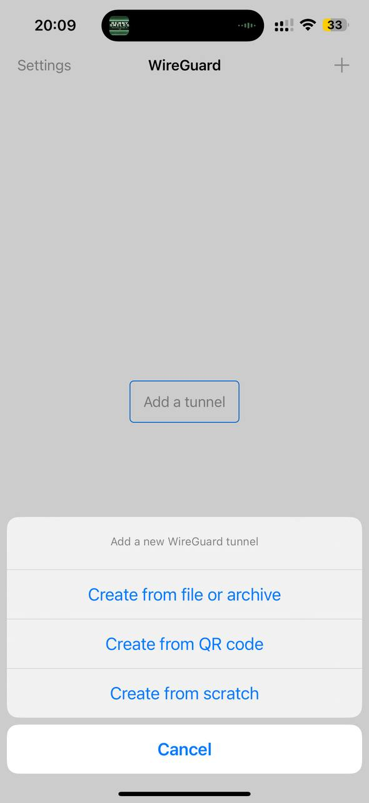
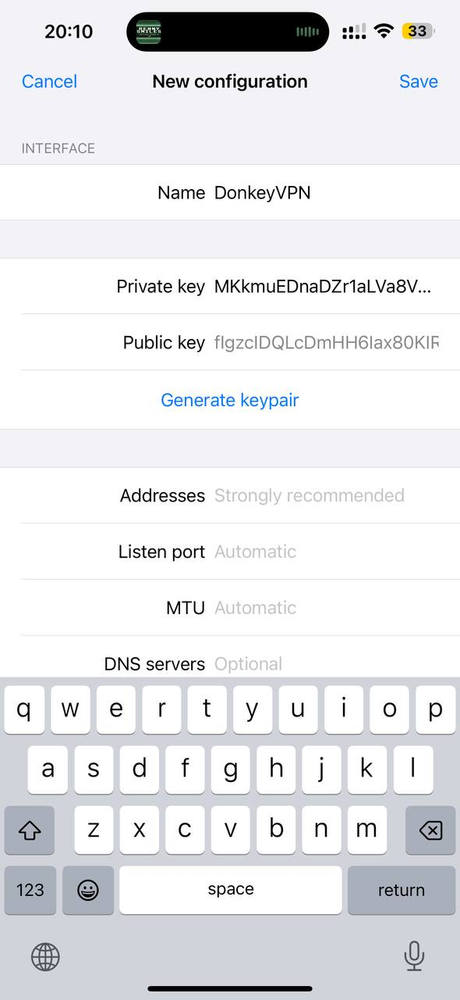
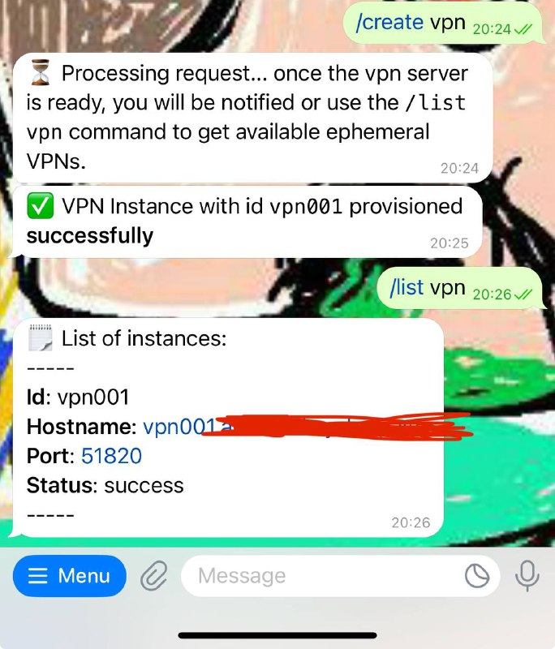
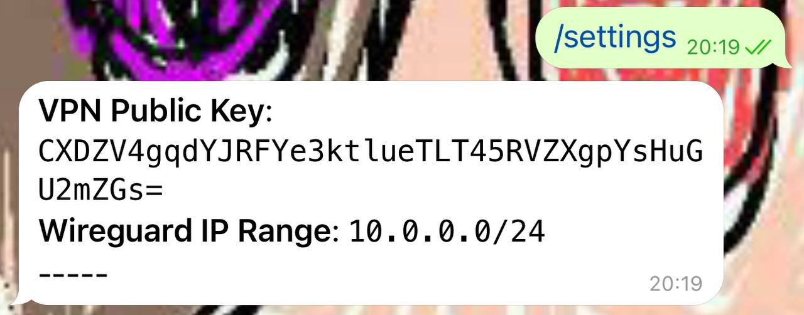
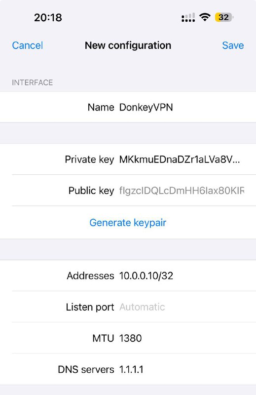
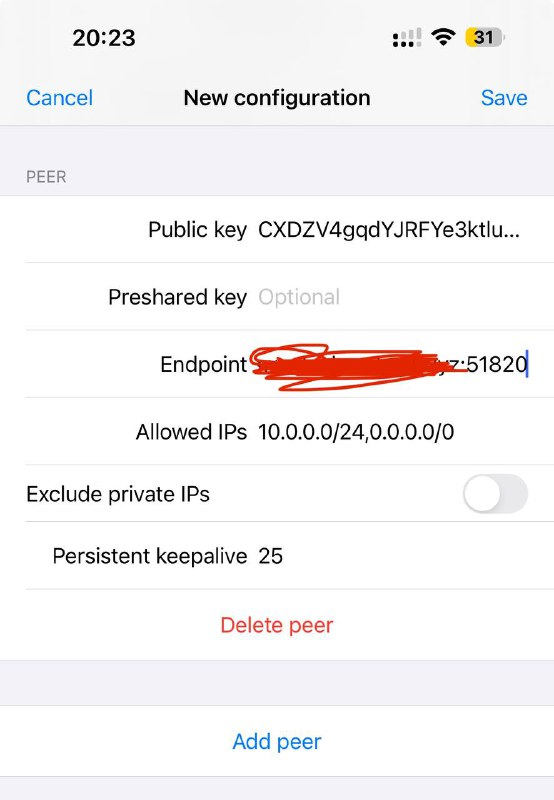
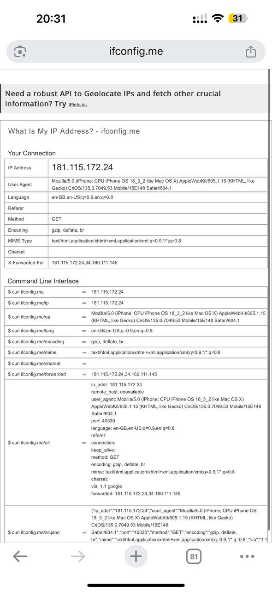
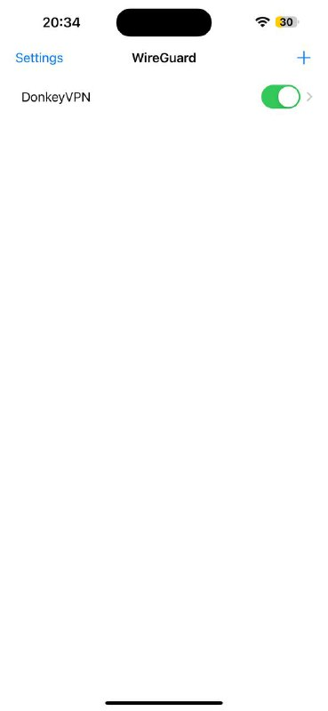
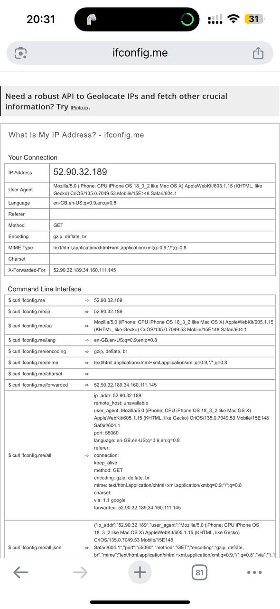

DonkeyVPN on iOS
===

Install [Wireguard application](https://apps.apple.com/us/app/wireguard/id1441195209) from App Store. Add a new tunnel, choose the "Create from scratch" option

Generate a keypair

Copy the public key and go to the Telegram Bot, and add a new peer using the `/create peer 10.0.0.10/32 <public_key>` command. You can use any ip address in the `10.0.0.0/24` range.

Create a new VPN server using `/create vpn` command. Wait until it's ready. Get the information using `/list vpn`.

Get server's public key using the `/settings` command and copy it

Go back to the Wireguard application and configure you VPN ip address with the same IP used when you executed the `/create peer` command

Add a new Peer, use the server's public key you got when executing the `/settings` command. The `Endpoint` field will be the domain name or IP address  plus the `51820` port that you get when you executed the `/list vpn` command, e.g. `12.23.45.67:51820` or `vpn001.example.com:51820`. Set the `Allowed IPs` field with `10.0.0.0/24,0.0.0.0/0` and `Persistent keepalive` with `25`

Before connecting, check you actual IP address using [ifconfig.me](https://ifconfig.me/)

Connect to the VPN

Check back again at [ifconfig.me](https://ifconfig.me/)

