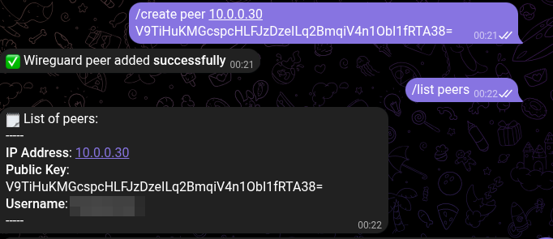
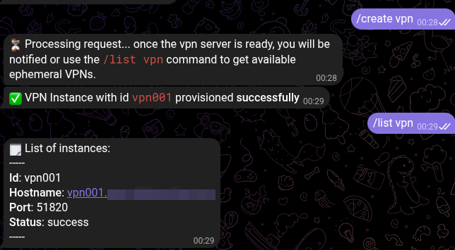
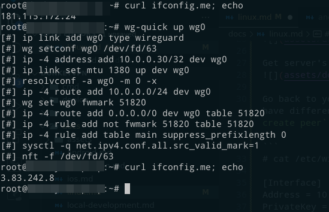

DonkeyVPN on GNU/Linux
===

> **Note:** GNU/Linux has many flavors, so some steps such as installation might differ between distros

Install the Wireguard, in my case I am using the `apt` package manager, but depending on your distro you will use something like `yum`, `dnf`, `pacman`, etc.

```
$ sudo apt install -y wireguard
```

Generate public and private keys, the next commands assume that you are root:

```
# cd /etc/wireguard
# wg genkey | tee privatekey | wg pubkey > publickey
```

Copy the public key and go to the Telegram Bot, and add a new peer using the `/create peer 10.0.0.10/32 <public_key>` command. You can use any ip address in the `10.0.0.0/24` range.



Create a new VPN server using `/create vpn` command. Wait until it's ready. Get the information using `/list vpn`.



Get server's public key using the `/settings` command and copy it


Go back to your terminal and create a `/etc/wireguard/wg0.conf` file, this will have different settings, including the public key you added when executed the `/create peer` command and the `/settings` command.

```
# cat /etc/wireguard/wg0.conf

[Interface]
Address = 10.0.0.30/32
PrivateKey = <<< the content of /etc/wireguard/privatekey >>>
MTU = 1380
DNS = 1.1.1.1

[Peer]
# Server's public key
PublicKey = CXDZV4gqdYJRFYe3ktlueTLT45RVZXgpYsHuGU2mZGs=
Endpoint = vpn001.example.com:51820 <<< replace with correct domain or ip address>>>
AllowedIPs = 10.0.0.0/24,0.0.0.0/0
PersistentKeepalive = 25

```

Once ready, check your current IP address, connect to the VPN and check address again:


